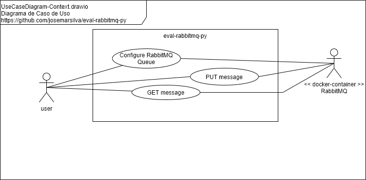

`eval-rabbitmq-py/README.md` - Evaluation RabbitMQ with Python

## 1. Introdução

Este repositório contém os artefatos do projeto **eval-rabbitmq-py** que consiste em uma avaliação dos mecanismos básicos da ferramenta de messaging RabbitMQ utilizando linguagem de programação Python.

* Tabela de Conteúdo
  * Introdução
  * Documentação
    * Diagrama de Caso de Uso (Use Case Diagram)
    * Diagrama de Implantação (Deploy Diagram)
  * Projeto
    * Pré-Requisitos, Pré-Condições e Premissas
    * Guia do Desenvolvedor e Administrador
    * Guia de Implantação, Configuração e Instalação
    * Guia de Execução, Demonstração e Cenários de Teste
	* Guia de Estudo
    * Design Patterns, Standard, Conventions and Best Practices
  * I - Referências


## 2. Documentação

### 2.1. Diagrama de Caso de Uso (Use Case Diagram)

 


### 2.2. Diagrama de Implantação (Deploy Diagram)

 


## 3. Projeto

### 3.1. Pré-Requisitos, Pré-Condições e Premissas

#### a. Tecnologias e ferramentas

* Python 3.8
* venv
* Docker or Kubernetes or VirtualBox or On-Premisse infrastructure (Deployment Infraestructure)


#### b. Ferramental de apoio

* Ferramenta: [Draw.IO](https://app.diagrams.net/) (only for diagrams design and documentation)


### 3.2. Guia do Desenvolvedor e Administrador

* Faça um clone do projeto `git clone`. Use o _branch_ `master` se o _branch_ `develop` não estiver disponível
* Leia as documentações disponíves em "2. Documentação"  and "3.x. Design Patterns, Standard, Conventions and Best Practices"


### 3.3. Guia de Implantação, Configuração e Instalação

#### a. RabbitMQ as-a-service free on Cloud AMQP

* Faça o login no service Colud AMQP
  * https://customer.cloudamqp.com/login
* Crie uma nova instância do serviço gratuito (free) chamado `Little Lemur` seguindo o passo a passo:

 
 
 
 
 
 


#### b. RabbitMQ in a DOCKER

* Run Docker container for RabbitMQ

```cmd
C:\..\eval-rabbitmq> docker run -d --hostname my-rabbit --name some-rabbit -p 5672:15672 -e RABBITMQ_DEFAULT_USER=admin -e RABBITMQ_DEFAULT_PASS=admin rabbitmq:3-management
```

* Login RabbitMQ
  * url: `http://localhost:5672`
  * username: `admin`
  * password: `admin`

PS: Don't forget to grant access on to port on Windows Firewall


 

* Expected dashboard painel

 


### 3.4. Guia de Demonstração e Teste

* n/a


### 3.5. Guia de Estudo

* n/a


## I - Referências

* https://hub.docker.com/_/rabbitmq
* Github README.md writing sintax
  * [Basic Github Markdown Writing Format](https://docs.github.com/pt/free-pro-team@latest/github/writing-on-github/basic-writing-and-formatting-syntax)  
  * [Github Markdown Chead Sheet](https://guides.github.com/pdfs/markdown-cheatsheet-online.pdf)
  * [Github Mastering Markdown](https://guides.github.com/features/mastering-markdown/#what)
